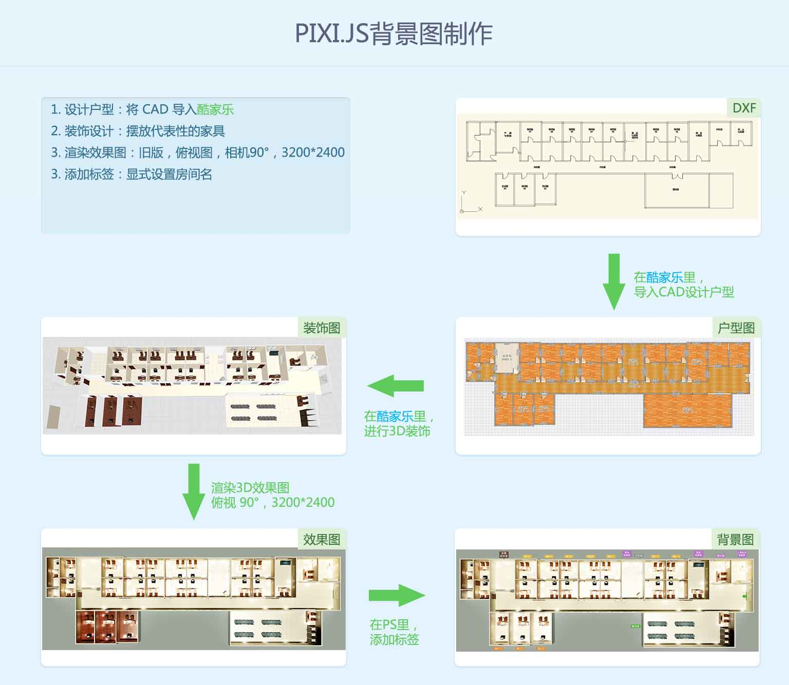
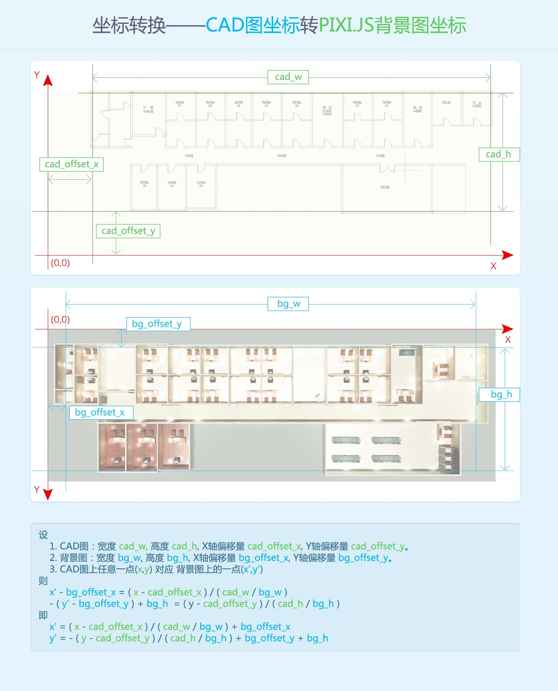
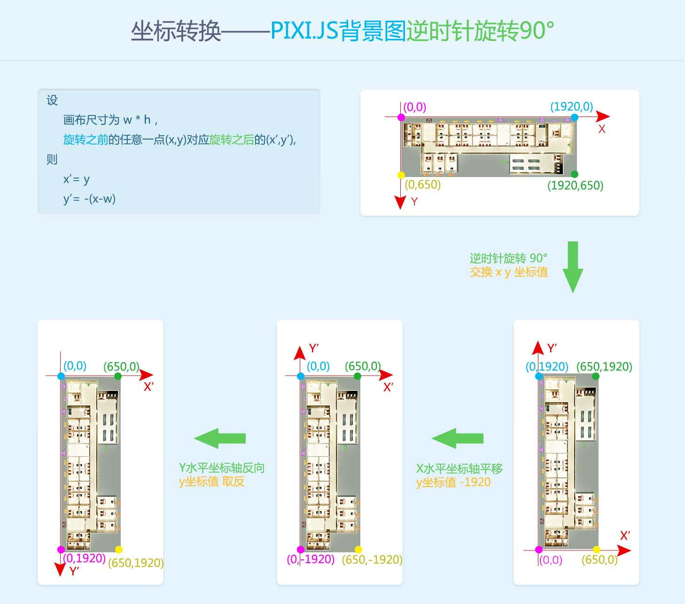

- [人员位置图——治安](#%E4%BA%BA%E5%91%98%E4%BD%8D%E7%BD%AE%E5%9B%BE%E2%80%94%E2%80%94%E6%B2%BB%E5%AE%89)
    - [1. 简介](#1-%E7%AE%80%E4%BB%8B)
    - [2. 编撰](#2-%E7%BC%96%E6%92%B0)
    - [3. 演示](#3-%E6%BC%94%E7%A4%BA)
    - [4. PIXI.JS背景图](#4-pixijs%E8%83%8C%E6%99%AF%E5%9B%BE)
    - [5. 坐标转换](#5-%E5%9D%90%E6%A0%87%E8%BD%AC%E6%8D%A2)
        - [5.1 CAD图坐标转PIXI.JS背景图坐标](#51-cad%E5%9B%BE%E5%9D%90%E6%A0%87%E8%BD%ACpixijs%E8%83%8C%E6%99%AF%E5%9B%BE%E5%9D%90%E6%A0%87)
        - [5.2 PIXI.JS背景图逆时针旋转90°](#52-pixijs%E8%83%8C%E6%99%AF%E5%9B%BE%E9%80%86%E6%97%B6%E9%92%88%E6%97%8B%E8%BD%AC90%C2%B0)
    - [6. 文档](#6-%E6%96%87%E6%A1%A3)
    
# 人员位置图——治安

## 1. 简介

 编写该文档的目的：记录转换流程。

## 2. 编撰

 吴钦飞（wuqinfei@qq.com）
 
## 3. 演示

 * [治安-横版](https://forwardnow.github.io/LocationMap/dist/index.html)
 * [治安-竖版](https://forwardnow.github.io/LocationMap/dist/index_vertical_3.html)

## 4. PIXI.JS背景图

**PIXI.JS背景图 尺寸**

 * 宽度：1920 px
 * 高度： 650 px
 
**装饰图 尺寸**

 * 宽度：3200 px
 * 高度：2400 px
 
**对装饰图进行自由变化**

 * 等比例缩放到原始尺寸的 68%
 * 设置参考点的水平位置（X）：956 
 * 设置参考点的垂直位置（Y）：342 

## 5. 坐标转换

### 5.1 CAD图坐标转PIXI.JS背景图坐标

    设
        1. CAD图：宽度 cad_w, 高度 cad_h, X轴偏移量 cad_offset_x, Y轴偏移量 cad_offset_y。
        2. 背景图：宽度 bg_w, 高度 bg_h, X轴偏移量 bg_offset_x, Y轴偏移量 bg_offset_y。
        3. CAD图上任意一点(x,y) 对应 背景图上的一点(x',y')
    则
        x' - bg_offset_x = ( x - cad_offset_x ) / ( cad_w / bg_w )
        - ( y' - bg_offset_y ) + bg_h  = ( y - cad_offset_y ) / ( cad_h / bg_h )
    即
        x' = ( x - cad_offset_x ) / ( cad_w / bg_w ) + bg_offset_x
        y' = - ( y - cad_offset_y ) / ( cad_h / bg_h ) + bg_offset_y + bg_h 
        
**CAD图有效区域参数**

  * 宽度  46341
  * 高度  13841
  * X轴偏移量   962
  * Y轴偏移量   714
  

**PIXI.JS背景图有效区域参数**

  * 宽度  1767
  * 高度  529
  * X轴偏移量   72
  * Y轴偏移量   77
  
**校验**
  
  * CAD图参数 有效区域 宽高比:     46341 / 13841 = 3.348096235821111
  * PIXI.JS背景图 有效区域 宽高比:  1767 /   529 = 3.340264650283554
  
**对应关系**

    x' = ( x - 962 ) / 26.225806451612904 + 72
    y' = ( y - 714 ) / -26.16446124763705 + 606

### 5.2 PIXI.JS背景图逆时针旋转90°

    设
        画布尺寸为 w * h，
            旋转之前的任意一点(x,y)对应旋转之后的(x’,y’),
    则
        x’= y
        y’= -(x-w)

## 6. 文档

    LocationMap\
        doc\
            ground.psd
            ground_vertical.psd
            zhian-0719-2.dwg
            zhian-0719-2.dxf
            PIXI.JS背景图制作.psd
            坐标转换——CAD图坐标转PIXI.JS背景图坐标.psd
            坐标转换——PIXI.JS背景图逆时针旋转90°.psd
            
            images\
                1.jpg
                2.jpg
                3.jpg
  
  
  * `ground.psd` 根据CAD图制作的2D效果图，尺寸 1920*650。
  * `ground_vertical.psd` 对`ground.psd`逆时针旋转90°后得到的2D效果图。
  * `zhian-0719-2.dxf` 原始CAD图。不规范，无法导入酷家乐直接使用。
  * `zhian-0719-2.dwg` 对原始CAD图进行重画得到。
  * `坐标轴转换.psd` 将背景图逆时针旋转90°后，坐标转换示意图
 

