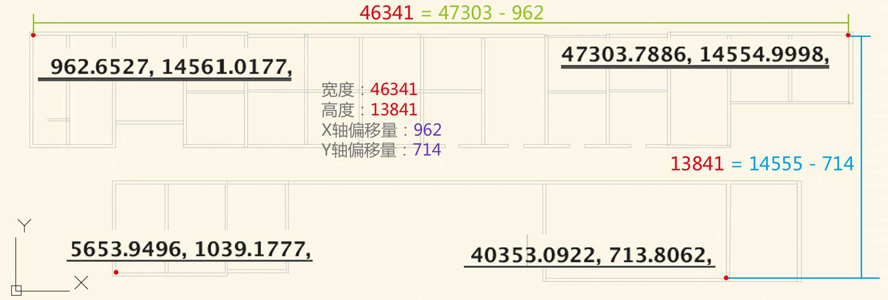
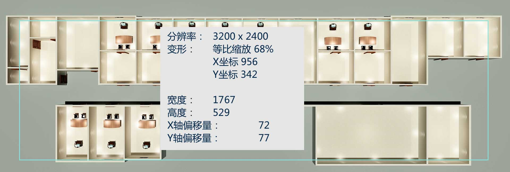
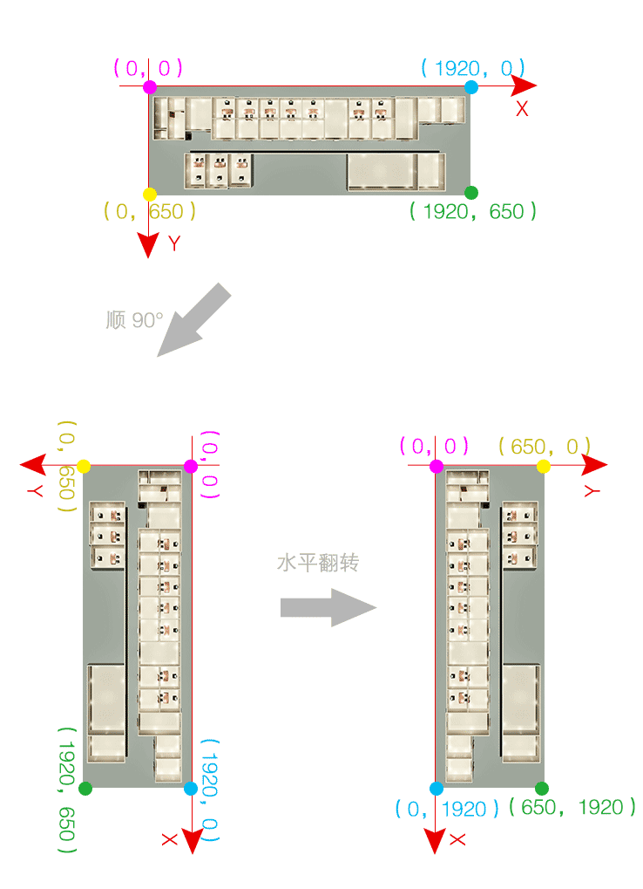

# 人员位置图——治安
- [人员位置图——治安](#%E4%BA%BA%E5%91%98%E4%BD%8D%E7%BD%AE%E5%9B%BE%E2%80%94%E2%80%94%E6%B2%BB%E5%AE%89)
    - [1. 简介](#1-%E7%AE%80%E4%BB%8B)
    - [2. 编撰](#2-%E7%BC%96%E6%92%B0)
    - [3. 演示](#3-%E6%BC%94%E7%A4%BA)
    - [4. 说明](#4-%E8%AF%B4%E6%98%8E)
    - [5. 文档](#5-%E6%96%87%E6%A1%A3)
    - [6. 使用](#6-%E4%BD%BF%E7%94%A8)
    - [7. 坐标转换](#7-%E5%9D%90%E6%A0%87%E8%BD%AC%E6%8D%A2)
        - [7.1 参数](#71-%E5%8F%82%E6%95%B0)
        - [7.2 求比例（ratio）](#72-%E6%B1%82%E6%AF%94%E4%BE%8B%EF%BC%88ratio%EF%BC%89)
        - [7.3 求差值（delta）](#73-%E6%B1%82%E5%B7%AE%E5%80%BC%EF%BC%88delta%EF%BC%89)
        - [7.4 综上](#74-%E7%BB%BC%E4%B8%8A)
        - [7.5 测试](#75-%E6%B5%8B%E8%AF%95)
    - [8. “横版”转“竖版”](#8-%E2%80%9C%E6%A8%AA%E7%89%88%E2%80%9D%E8%BD%AC%E2%80%9C%E7%AB%96%E7%89%88%E2%80%9D)
        - [8.1 尺寸](#81-%E5%B0%BA%E5%AF%B8)
        - [8.2 转化](#82-%E8%BD%AC%E5%8C%96)

## 1. 简介

 编写该文档的目的：方便维护。

## 2. 编撰

 吴钦飞（wuqinfei@qq.com）
 
## 3. 演示

 * [治安-横版](https://forwardnow.github.io/LocationMap/dist/index.html)
 * [治安-竖版](https://forwardnow.github.io/LocationMap/dist/index_vertical.html)

## 4. 说明

 * 酷家乐：室内装修效果图在线设计-酷家乐：https://www.kujiale.com/
 * 2D图：使用 2D游戏引擎PIXI.js 使用的背景   
 * CAD图：zhian-0719-2.dwg 、 zhian-0719-2.dxf

## 5. 文档

    LocationMap\
        doc\
            3200x2400_90deg_dark.jpg        
            ground.psd
            zhian-0719-2.dwg
            zhian-0719-2.dxf
  
        
* `zhian-0719-2.dxf` 原始CAD图，导入 酷家乐 生成的户型图非常不完整。
* `zhian-0719-2.dwg` 比对 原始CAD图 重新绘制的CAD图。
* `3200x2400_90deg_dark.jpg` 酷家乐 生成的效果图，相机参数 俯视 90°
* `ground.psd` 2D图 背景 

 
## 6. 使用

**示例**：

    LocationMap\
        dist\
            index.html
            
**设置 CAD图坐标 转 2D坐标 的转换器**

    window.LocationMap.Config.convertPosition = function ( pos ) {
        let
            cad_x = pos.x,
            cad_y = pos.y
        ;
    
        return {
            x: ( cad_x - 962 ) / 26.225806451612904 + 72,
            y: ( cad_y - 714 ) / -26.16446124763705 + 606
        };
    };

****    

## 7. 坐标转换

求 **2D图(x,y) 与 CAD图(x',y') 的坐标映射关系 f1、f2**
 
  * x = f1(x')
  * y = f2(y')  

即，求 

  * x = x' / ratio_width + delta_x
  * y = y' / ratio_height + delta_y 

 
因此，需要求出

  * `ratio_width` CAD图有效区域的宽度 与 2D图有效区域的宽度 的比值
  * `ratio_height` CAD图有效区域的高度 与 2D图有效区域的高度 的比值
  * `delta_x` X轴方向的差值
  * `delta_y` Y轴方向的差值

### 7.1 参数

**CAD图参数**

  * 宽度  46341
  * 高度  13841
  * X轴偏移量   962
  * Y轴偏移量   714
  

**2D图参数**

  * 宽度  1767
  * 高度  529
  * X轴偏移量   72
  * Y轴偏移量   77
  
**校验**
  
  * CAD图参数 宽高比:  46341 / 13841 = 3.348096235821111
  * CAD图参数 宽高比:  1767 / 529    = 3.340264650283554

### 7.2 求比例（ratio）

ratio_width = 46341 / 1767 = 26.225806451612904

ratio_height = 13841 / 529 = 26.16446124763705

### 7.3 求差值（delta）

2D图的坐标原点在左上角，CAD图的坐标原点在左下角

x - 72 = ( x' - 962 ) / ratio_width

529 - ( y - 77 ) = ( x' - 714 ) / ratio_height

### 7.4 综上

x = ( x' - 962 ) / 26.225806451612904 + 72

y = ( y' - 714 ) / -26.16446124763705 + 606

### 7.5 测试
    
    CAD图：(5653, 1039)
    2D图：(251,595)
    x = ( 5653 - 962 ) / 26.225806451612904 + 72 = 250.86961869618696
    y = 606 - ( 1039 - 714 ) / 26.16446124763705 = 593.5785709125063

    CAD图：(9657,8339)
    2D图：(403,315)
    x = ( 9657 - 962 ) / 26.225806451612904 + 72 = 403.54366543665435
    y = 606 - ( 8339 - 714 ) / 26.16446124763705 = 314.57416371649447
    
## 8. “横版”转“竖版”

### 8.1 尺寸

**“横版”**
  * 宽度：1920 px
  * 高度： 650 px
  
**“竖版”**
  * 宽度： 760 px
  * 高度：1050 px   
  
### 8.2 转化

**界面**

在PSD中对画布进行逆时针90°旋转 再进行水平翻转。

【画布】：图片

**旋转后的尺寸**

  * 宽度： 650 px
  * 高度：1920 px
  
**坐标**

互换 x 、y 坐标

**解决画布溢出容器的问题**

  * 方案1：设置容器的滚动条
  * 方案2：添加交互，比如 滑动鼠标滚轮进行缩放、拖拽改变画布的位置
  
已内置 【方案2】 
 

